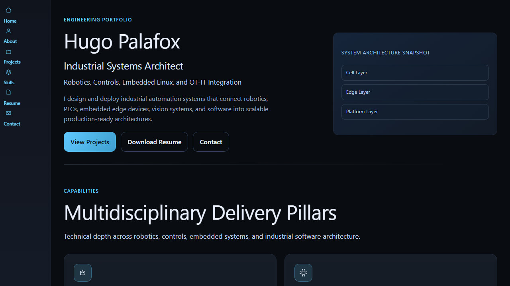

# Portafolio

[](https://github.com/hugo-palafox/Portafolio/actions/workflows/deploy-github-pages.yml)


Technical portfolio built with Blazor WebAssembly to present robotics, industrial automation, embedded edge, and OT-IT integration projects with case-study style detail.

## Preview



## Stack

- .NET 8 (`Blazor WebAssembly`)
- C#
- Tailwind CSS (compiled into `wwwroot/css/tailwind.generated.css`)
- Static seeded content (`Data/SeedData.cs`)

## Highlights

- Multi-page portfolio with project detail routes (`/projects/{slug}`)
- Reusable component-based UI (`Components/`)
- Structured seed-data model for projects, skills, and home content
- Resume preview/download page and contact surface

## Run Locally

### Prerequisites

- [.NET SDK 8.x](https://dotnet.microsoft.com/download/dotnet/8.0)
- [Node.js LTS](https://nodejs.org/) (for Tailwind CSS tooling)

### Install dependencies

```bash
npm install
```

### Build CSS once

```bash
npm run build:css
```

### Watch CSS during development

```bash
npm run watch:css
```

### Run the app

```bash
dotnet run --project Portafolio.csproj
```

Default dev URLs (from `launchSettings.json`):
- `http://localhost:5189`
- `https://localhost:7240`

## Build for Production

```bash
dotnet build Portafolio.sln -c Release
dotnet publish Portafolio.csproj -c Release
```

Publish output is generated under `bin/Release/net8.0/publish/`.

## Project Structure

```text
Portafolio/
  Components/      # Reusable Razor components
  Pages/           # Route pages (Home, Projects, Skills, Resume, Contact, etc.)
  Services/        # Read-only data access services
  Data/            # Seed content and portfolio data models
  Models/          # Domain models for projects/skills/navigation
  Layouts/         # Main layout and navigation shell
  Styles/          # Tailwind input stylesheet
  wwwroot/         # Static assets, generated css, images, resume
```

## Content Management

Portfolio content is source-controlled and managed in:
- `Data/SeedData.cs`

This includes:
- Home hero content and metrics
- Project cards + detail page data
- Skill categories
- Navigation items

## Deployment Notes

- GitHub Pages deployment is automated via `.github/workflows/deploy-github-pages.yml`.
- You can also deploy the `dotnet publish` output to any static host/CDN that supports Blazor WebAssembly assets.

## GitHub Pages Deployment (Ready to Use)

This repository now includes a ready-to-use workflow:
- `.github/workflows/deploy-github-pages.yml`

It is configured for **GitHub Pages project hosting** at:
- `https://hugo-palafox.github.io/Portafolio/`

### One-time GitHub setup

1. Go to `Settings > Pages`.
2. Under `Build and deployment`, choose `Source: GitHub Actions`.
3. Ensure your default branch is `main` (or update the workflow trigger branch).

### How it works

- Builds and publishes the Blazor app in Release mode.
- Rewrites `<base href="/">` to `<base href="/Portafolio/">` for project-site routing.
- Copies `index.html` to `404.html` so deep links work on GitHub Pages.
- Deploys the published `wwwroot` artifact with official `actions/deploy-pages`.

### If your hosting target changes

- For `https://<user>.github.io/` root hosting or a custom domain, update the workflow base path replacement from `/Portafolio/` to `/`.

## Repository Notes

- `DEVELOPMENT_LOG.md` tracks implementation sessions and decisions.
- `TASK_PROGRESS.md` tracks planned, completed, and next tasks.
- `HANDOFF.md` contains quick onboarding context for future contributors/agents.
